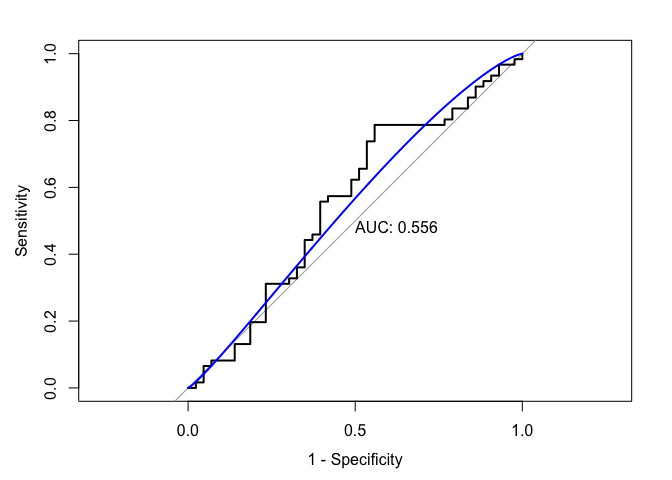
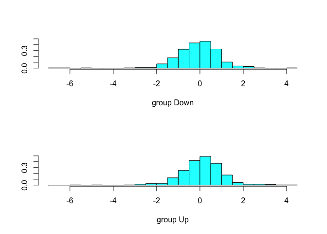

Homework 3
================
Chirag Shah
2019-04-06

Part a

``` r
library(ISLR)
library(caret)
```

    ## Loading required package: lattice

    ## Loading required package: ggplot2

``` r
library(glmnet)
```

    ## Loading required package: Matrix

    ## Loading required package: foreach

    ## Loaded glmnet 2.0-16

``` r
library(MASS)
library(e1071)
```

    ## Warning: package 'e1071' was built under R version 3.5.2

``` r
library(mlbench)
library(pROC)
```

    ## Warning: package 'pROC' was built under R version 3.5.2

    ## Type 'citation("pROC")' for a citation.

    ## 
    ## Attaching package: 'pROC'

    ## The following object is masked from 'package:glmnet':
    ## 
    ##     auc

    ## The following objects are masked from 'package:stats':
    ## 
    ##     cov, smooth, var

``` r
library(AppliedPredictiveModeling)

summary(Weekly)
```

    ##       Year           Lag1               Lag2               Lag3         
    ##  Min.   :1990   Min.   :-18.1950   Min.   :-18.1950   Min.   :-18.1950  
    ##  1st Qu.:1995   1st Qu.: -1.1540   1st Qu.: -1.1540   1st Qu.: -1.1580  
    ##  Median :2000   Median :  0.2410   Median :  0.2410   Median :  0.2410  
    ##  Mean   :2000   Mean   :  0.1506   Mean   :  0.1511   Mean   :  0.1472  
    ##  3rd Qu.:2005   3rd Qu.:  1.4050   3rd Qu.:  1.4090   3rd Qu.:  1.4090  
    ##  Max.   :2010   Max.   : 12.0260   Max.   : 12.0260   Max.   : 12.0260  
    ##       Lag4               Lag5              Volume       
    ##  Min.   :-18.1950   Min.   :-18.1950   Min.   :0.08747  
    ##  1st Qu.: -1.1580   1st Qu.: -1.1660   1st Qu.:0.33202  
    ##  Median :  0.2380   Median :  0.2340   Median :1.00268  
    ##  Mean   :  0.1458   Mean   :  0.1399   Mean   :1.57462  
    ##  3rd Qu.:  1.4090   3rd Qu.:  1.4050   3rd Qu.:2.05373  
    ##  Max.   : 12.0260   Max.   : 12.0260   Max.   :9.32821  
    ##      Today          Direction 
    ##  Min.   :-18.1950   Down:484  
    ##  1st Qu.: -1.1540   Up  :605  
    ##  Median :  0.2410             
    ##  Mean   :  0.1499             
    ##  3rd Qu.:  1.4050             
    ##  Max.   : 12.0260

Plotting Graphical Summaries
----------------------------

``` r
#simple plot with Lag1 as the predictor (can be done for the other Lag variables)
plot(Today~Lag1, col = "red", data = Weekly)
simplelm = lm(Today~Lag1, data = Weekly)
abline(simplelm, lwd = 3, col = "grey")
```


``` r
#simple plot with Volume as the predictor
plot(Today~Volume, col = "blue", data = Weekly)
simplelm2 = lm(Today~Volume, data = Weekly)
abline(simplelm2, lwd = 3, col = "grey")
```


``` r
#simple plot with Year as the predictor
plot(Today~Year, col = "green", data = Weekly)
simplelm3 = lm(Today~Year, data = Weekly)
abline(simplelm3, lwd = 3, col = "grey")
```


Part b

``` r
logmod <- glm(Direction~Lag1+Lag2+Lag3+Lag4+Lag5+Volume, family = "binomial", data = Weekly)
summary(logmod)
```

    ## 
    ## Call:
    ## glm(formula = Direction ~ Lag1 + Lag2 + Lag3 + Lag4 + Lag5 + 
    ##     Volume, family = "binomial", data = Weekly)
    ## 
    ## Deviance Residuals: 
    ##     Min       1Q   Median       3Q      Max  
    ## -1.6949  -1.2565   0.9913   1.0849   1.4579  
    ## 
    ## Coefficients:
    ##             Estimate Std. Error z value Pr(>|z|)   
    ## (Intercept)  0.26686    0.08593   3.106   0.0019 **
    ## Lag1        -0.04127    0.02641  -1.563   0.1181   
    ## Lag2         0.05844    0.02686   2.175   0.0296 * 
    ## Lag3        -0.01606    0.02666  -0.602   0.5469   
    ## Lag4        -0.02779    0.02646  -1.050   0.2937   
    ## Lag5        -0.01447    0.02638  -0.549   0.5833   
    ## Volume      -0.02274    0.03690  -0.616   0.5377   
    ## ---
    ## Signif. codes:  0 '***' 0.001 '**' 0.01 '*' 0.05 '.' 0.1 ' ' 1
    ## 
    ## (Dispersion parameter for binomial family taken to be 1)
    ## 
    ##     Null deviance: 1496.2  on 1088  degrees of freedom
    ## Residual deviance: 1486.4  on 1082  degrees of freedom
    ## AIC: 1500.4
    ## 
    ## Number of Fisher Scoring iterations: 4

Of the 6 predictors in the model, the only predictor that was statistically significant was Lag2. The values from 2 weeks before a current values significantly predicts direction. Because our model is a logistic model, the exponentiated coefficient will give us the the change in odds ratio. An increase of 1 in Lag2 increases the odds of direction by e^0.058 = 1.06 compared to the original odds.

Part c

``` r
#Creating confusion matrix
prob = predict(logmod, type = "response")
pred = rep("Down", 1089)
pred[prob > 0.5] = "Up"
confusionMatrix(data = as.factor(pred), reference = Weekly$Direction, positive = "Down")
```

    ## Confusion Matrix and Statistics
    ## 
    ##           Reference
    ## Prediction Down  Up
    ##       Down   54  48
    ##       Up    430 557
    ##                                          
    ##                Accuracy : 0.5611         
    ##                  95% CI : (0.531, 0.5908)
    ##     No Information Rate : 0.5556         
    ##     P-Value [Acc > NIR] : 0.369          
    ##                                          
    ##                   Kappa : 0.035          
    ##  Mcnemar's Test P-Value : <2e-16         
    ##                                          
    ##             Sensitivity : 0.11157        
    ##             Specificity : 0.92066        
    ##          Pos Pred Value : 0.52941        
    ##          Neg Pred Value : 0.56434        
    ##              Prevalence : 0.44444        
    ##          Detection Rate : 0.04959        
    ##    Detection Prevalence : 0.09366        
    ##       Balanced Accuracy : 0.51612        
    ##                                          
    ##        'Positive' Class : Down           
    ## 

Overall Fraction of Correct Predictions: 611/1089 = 0.5611

Based on the confusion matrix, we can see that the prediction shows that most of the cases go up (i.e. 987/1089 cases) whereas in reality there are only 605/1089 that go up. This indicates that our prediction model does a poor job of predicting direction. In light of this, we can find a very large proportion of true positives from our model (i.e. that are truly UP: 557/605 = 0.921) at the cost/tradeoff of finding many false positives (i.e. that we have falsely predicted as UP: 430/987 = 0.436).

Part d

``` r
test.pred.prob  <- predict(logmod, newdata = Weekly, type = "response")

roc.glm <- roc(Weekly$Direction, test.pred.prob)
plot(roc.glm, legacy.axes = TRUE, print.auc = TRUE)
plot(smooth(roc.glm), col = 4, add = TRUE)
```


The AUC is 0.554.

Part e

``` r
training.data = Weekly[Weekly$Year < 2009,]
test.data = Weekly[Weekly$Year > 2008,]

logmod2 = glm(Direction~Lag1+Lag2, data = training.data, family = "binomial")
summary(logmod2)
```

    ## 
    ## Call:
    ## glm(formula = Direction ~ Lag1 + Lag2, family = "binomial", data = training.data)
    ## 
    ## Deviance Residuals: 
    ##     Min       1Q   Median       3Q      Max  
    ## -1.6149  -1.2565   0.9989   1.0875   1.5330  
    ## 
    ## Coefficients:
    ##             Estimate Std. Error z value Pr(>|z|)   
    ## (Intercept)  0.21109    0.06456   3.269  0.00108 **
    ## Lag1        -0.05421    0.02886  -1.878  0.06034 . 
    ## Lag2         0.05384    0.02905   1.854  0.06379 . 
    ## ---
    ## Signif. codes:  0 '***' 0.001 '**' 0.01 '*' 0.05 '.' 0.1 ' ' 1
    ## 
    ## (Dispersion parameter for binomial family taken to be 1)
    ## 
    ##     Null deviance: 1354.7  on 984  degrees of freedom
    ## Residual deviance: 1347.0  on 982  degrees of freedom
    ## AIC: 1353
    ## 
    ## Number of Fisher Scoring iterations: 4

``` r
test.pred.prob2 <- predict(logmod2, newdata = test.data, type = "response")

roc.glm2 <- roc(test.data$Direction, test.pred.prob2)
plot(roc.glm2, legacy.axes = TRUE, print.auc = TRUE)
plot(smooth(roc.glm2), col = 4, add = TRUE)
```



The AUC is 0.556.

Part f

``` r
#LDA
lda.fit <- lda(Direction~Lag1+Lag2, data = training.data)
plot(lda.fit)
```



``` r
#LDA ROC Curve
lda.pred <- predict(lda.fit, newdata = test.data, type = "prob")
head(lda.pred$posterior)
```

    ##          Down        Up
    ## 986 0.5602039 0.4397961
    ## 987 0.3079163 0.6920837
    ## 988 0.4458032 0.5541968
    ## 989 0.4785107 0.5214893
    ## 990 0.4657943 0.5342057
    ## 991 0.5262907 0.4737093

``` r
roc.lda <- roc(test.data$Direction, lda.pred$posterior[,2])

plot(roc.lda, legacy.axes = TRUE, print.auc = TRUE)
plot(smooth(roc.lda), col = 4, add = TRUE)
```


The AUC value for the LDA model is 0.557.

``` r
#QDA
qda.fit <- qda(Direction~Lag1+Lag2, data = training.data)
qda.fit
```

    ## Call:
    ## qda(Direction ~ Lag1 + Lag2, data = training.data)
    ## 
    ## Prior probabilities of groups:
    ##      Down        Up 
    ## 0.4477157 0.5522843 
    ## 
    ## Group means:
    ##              Lag1        Lag2
    ## Down  0.289444444 -0.03568254
    ## Up   -0.009213235  0.26036581

``` r
#QDA ROC Curve
qda.pred <- predict(qda.fit, newdata = test.data, type = "prob")
head(qda.pred$posterior)
```

    ##          Down        Up
    ## 986 0.5436205 0.4563795
    ## 987 0.3528814 0.6471186
    ## 988 0.2227273 0.7772727
    ## 989 0.3483016 0.6516984
    ## 990 0.4598550 0.5401450
    ## 991 0.5119613 0.4880387

``` r
roc.qda <- roc(test.data$Direction, qda.pred$posterior[,2])

plot(roc.qda, legacy.axes = TRUE, print.auc = TRUE)
plot(smooth(roc.qda), col = 4, add = TRUE)
```


The AUC for the QDA is 0.529.

Part g

``` r
training.data2 = (Weekly$Year < 2009)
test.data2 = (Weekly$Year > 2008)
train_weekly = Weekly[!training.data2,2:3]
train_direction = Weekly$Direction[!training.data2]

ctrl <- trainControl(method = "repeatedcv",
                     repeats = 5,
                     summaryFunction = twoClassSummary,
                     classProbs = TRUE)
set.seed(1)
model.knn <- train(x = Weekly[training.data2,2:3],
                   y = Weekly$Direction[training.data2],
                   method = "knn",
                   preProcess = c("center","scale"),
                   tuneGrid = data.frame(k = seq(1, 50, by = 2)),
                   trControl = ctrl,
                   metric = 'ROC')
ggplot(model.knn)
```


``` r
#KNN ROC Curve
knn.pred <- predict(model.knn, newdata = train_weekly, type = "prob")[,2]
roc.knn <- roc(train_direction, knn.pred)
plot(roc.knn, legacy.axes = TRUE, print.auc = TRUE)
```


The AUC for the KNN is 0.545.

Given that the LDA had the greatest AUC value (0.557), that is the model that has the greatest probability of getting the prediction correct (i.e. the actual value in the dataset). The other models had similar AUC values but were slightly less.
